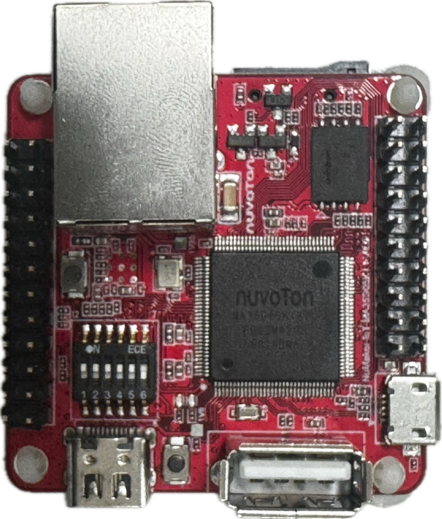

# NuMaker-IoT-MA35D05KI1

## Introduction

The NuMaker-IoT-MA35D05KI1 is an evaluation board for Nuvoton NuMicro MA35D0 series microprocessors. It integrates core components to simplify system design, including:

- MA35D05KI67C microprocessor (LQFP128 package with 256MB DDR3L)
- PMIC power supply solution
- One Gigabit Ethernet PHY

The board features rich peripherals such as:

- 1x Gigabit Ethernet
- USB 2.0 high-speed host and device
- 1x SD 2.0 (Micro SD slot)
- 4x CAN FD
- QSPI, I2C, UART serial communication ports

This makes it ideal for evaluation in applications like HMI, industrial control, home appliances, 2-wheel clusters, medical devices, new energy systems, machine learning, and other creative projects.

<p align="center">

</p>

## Supported Compiler

The board supports the GCC compiler. Tested version:

| Compiler | Tested Version |
|----------|----------------|
| GCC      | Arm Embedded Toolchain 10.3-2021.10 (Env 1.3.5 embedded version) |

## Building RT-Thread

To build `rt-thread.bin` for the NuMaker-IoT-MA35D05KI1 board:

```bash
cd rt-thread/bsp/nuvoton/numaker-iot-ma35d05ki1
menuconfig --generate
scons -c
pkgs --update
scons -j 16
```

The output file will be located at:

```
<Path-to-rt-thread>\bsp\nuvoton\numaker-iot-ma35d05ki1\rtthread.bin
```

## Programming Firmware Using NuWriter

Configure the SW7 dip-switch on the NuMaker-IoT-MA35D05KI1 base board according to the target memory storage.

**Dip-switch Settings:**

- L: OFF
- H: ON

### Memory Storage Options

| Memory Storage | Burn to Settings | Boot from Settings |
|----------------|------------------|--------------------|
| **DDR** | Switch HSUSB0_ID to Low; others are High | - |
| **SD1**<br>(SD1 device, 4-bit mode) | Switch HSUSB0_ID to Low; others are High | Switch PG3 to Low; others are High |
| **Serial NAND**<br>(4-bit mode) | Switch HSUSB0_ID to Low; others are High | Switch PG2, PG3 to Low; others are High |

### Download to DDR and Run

Run the Windows batch script to download `rtthread.bin` into memory and execute it:

```bash
<path-to-rtthread>\bsp\nuvoton\numaker-iot-ma35d05ki1\uwriter_scripts\nuwriter_ddr_download_and_run.bat
```

### Burn to SD1

Run the Windows batch script to program `rtthread.bin` to the SD card:

```bash
<path-to-rtthread>\bsp\nuvoton\numaker-iot-ma35d05ki1\uwriter_scripts\nuwriter_program_sd.bat
```

### Burn to Serial NAND

Run the Windows batch script to program `rtthread.bin` to SPI-NAND flash:

```bash
<path-to-rtthread>\bsp\nuvoton\numaker-iot-ma35d05ki1\nuwriter_scripts\nuwriter_program_spinand.bat
```

## Testing

Use a terminal emulator like Tera Term to connect via serial communication. Check the Windows Device Manager for the Nuvoton Virtual Com Port number.

Serial communication parameters:

- Baud rate: 115200
- Data bits: 8
- Stop bits: 1
- Parity: None
- Flow control: None

## Purchase

- [Nuvoton Direct](https://direct.nuvoton.com/en/numaker-iot-ma35d05ki1)
